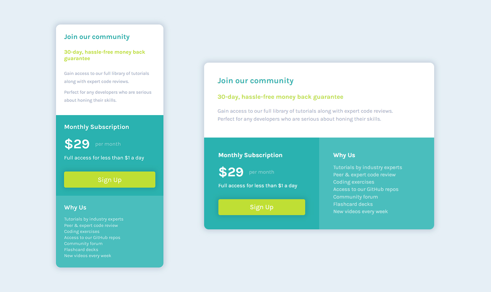

# Frontend Mentor - Single price grid component solution

This is a solution to the [Single price grid component challenge on Frontend Mentor](https://www.frontendmentor.io/challenges/single-price-grid-component-5ce41129d0ff452fec5abbbc). Frontend Mentor challenges help you improve your coding skills by building realistic projects. 

## Table of contents

- [Overview](#overview)
  - [The challenge](#the-challenge)
  - [Screenshot](#screenshot)
- [My process](#my-process)
  - [Built with](#built-with)
  - [What I learned](#what-i-learned)
  - [Continued development](#continued-development)
  - [Useful resources](#useful-resources)
- [Author](#author)

## Overview

### The challenge

Users should be able to:

- View the optimal layout for the component depending on their device's screen size
- See a hover state on desktop for the Sign Up call-to-action

### Screenshot




(I know the hover animation here is not obvious to see for its color setting, that's the reason why color theory is important to designer and frontend developer.)


## My process

### Built with

- CSS Grid
- Mobile-first workflow

### What I learned

#### Grid

When I looked at the picture of this component at first, Grid is what I thought could be used on this project for its structure layout. So once we centered whole component, we start using Grid like this: 

```css
/* layout structure like flex and grid needs a container to hold the element we want to modify with, which is called like "flex-container" and "grid-container" */

.grid-container {
    /* use display property to announce the different layout against original flow at first */
    display: grid;
}
```
After that, we should destruct the component to see what we want to get with grid:

 

Apparently to see, its structure layout is nothing but three parts: the part on top cross the entire width while two parts below it divided bottom space evenly. But how could we make it? At that point, its necessary for us to know how does grid work at first. Here is an example:

Since we already known how to get a grid container, let's puts some element in it:

```html
<div class="grid-container">
    <div class="grid-item one"></div>
    <div class="grid-item two"></div>
    <div class="grid-item three"></div>
</div>
```
In that case and other similar situations, we usually make the difference more valid by setting background color and border and sort of ways to distinguish different elements.

```css
.grid-container {
    display: grid;
    /* give container a size to see what happened on screen */
    width: 400px;
    height: 600px;
}

.one {
    background-color: #2ab2af;
}

.two {
    background-color: #98a6bd;
}

.three {
    background-color: #c0df34;
}
```

We don't need to set any properties to the child elements for they all been viewed as so automatically. But before we turn to next step, everything is no difference with the flow layout. 


For that reason, it's time to use another gird property to container element:

``` css
.grid-container {
    /* use display property to announce the different layout against original flow at first */
    display: grid;
    /* one of grid properties which set how many columns and the width of each column */
    grid-template-columns: auto 300px;
}
```


What's that mean? For the code above, its just saying "Well, now we apply grid and start from its columns. How many values put in that `grid-template-columns` property means according columns there are, and the value itself is each grid element could take over the space", that's why we see the second element go upstairs to fill the space that remain in first row what the third could not. Now, we know we could set the structure layout and size a element could take, then we can move to our goal:

~~~ css
.grid-container {
    display: grid;
    width: 400px;
    height: 600px;
}


.one {
    background-color: #2ab2af;
    /* make the first part cross two columns, rest parts will be placed by default as stand still */
    grid-column: span 2;
}

.two {
    background-color: #98a6bd;
}

.three {
    background-color: #c0df34;
}
~~~


This shows how creative the grid is, because of that we can achieve our component's structure in a smooth way.

I've talked a lot about why I use grid in this project and a basic way to practice it. It's far beyond that, and I used it in my solution by another way which applied `grid-area` in each grid element for setting structure more convenient. Just go deeper and deeper and finish more project with grid to experience its powerful functionality.

#### Vertical align

When I working with two `<span>` tags (which is "$29" and "per month"), I encounter an align problem. 

```html
<p><span class="money">29%</span><span class="rate"> per month</span></p>
```

``` css
.money {
    font-size: 32px;
    font-weight: 700;
}
```


Once we set two `span` tags side by side with different font size and we also want to center them vertically in paragraph, I came up a solution like this:

``` css
.money {
    font-size: 32px;
    font-weight: 700;
}
/* use height and line-height combination in p tag (give two properties the same value) */
p {
    height: 50px;
    inline-height: 50px;
}
```

Nothing happened after that. So there must be other ways to complete that goal. Finally, I found a property called vertical-align, how straightforward it is. And we set it in both `<span>` tag.

``` css
.money {
    font-size: 32px;
    font-weight: 700;
    vertical-align: middle;
}

/* test result shows there is no need to set vertical-align property to span.rate  */
/* but there is a small difference on the screen after applied it and I still don't know why */
/*
.rate {
    vertical-align: middle;
}
*/
```


#### Mobile-first workflow

I really don't know what 'Mobile-first workflow' means at first when I saw the phrase [here](#Built with) (because it was generated as a template), so I searched it then found a blog called [Mobile-first is a great workflow](https://www.donnywals.com/mobile-first-is-a-great-workflow/) written by Donny. It explained fully what it is and how it makes developers work efficient.

Before I read that blog, I used Desktop-first workflow to finish this project. At last all things looks not so bad, but I am always confused about the edge. What I mean edge here is when resizing the screen where the space between the screen and component. So I want to use Mobile-first workflow to reset my old style sheet to see if the problem could be fixed that way.

For the code I wrote, two style sheets' lines seems no big different, but the component effect becomes more practical. The edge problem above was handled better than before. The most important thing, as the blog I mentioned said, Mobile-first workflow reduce verbose code. Adding code is easy than removing. By now, I fully recommend coding by this workflow.

### Continued development

#### Units

Units, when we talk about it everyone could saying a sort of, like `px`, `%`, `em`, `rem`, `vw`, `vh` and so on. First we need to figure out what these are and how, and the most complicated part is among many numerical properties which unit could fit best. Truth be told, I spent a lot of time on choosing the appropriate unit for simulating the result picture also tried to make it changeable during the screen resizing, it's a experience job and need more efforts on it.

#### Code readability

I've never shared code I wrote with others before, but as a newbie to this area I think sharing is a efficient way to help myself to discover my drawbacks and moving towards a better part. Surly, this is way must be made by all the members from the community. For the effect we could make is different from one to another, but I believe the more you share, the better code readability you will get.

#### Real application environment

I know it's far from where I get at present, but I am curious about the situation where the component like this project is been used in a real application. Would that be different? It's definitely is, but what should a frontend developer more focus on, and what tools need to be used and many details is a whole unknown part ahead. But I am still confused right now. Mark them here and turn back and solve them the day I learn.

### Useful resources

- [HSL Color Picker - by Brandon Mathis](https://hslpicker.com/) - This helped me for color choosing. I really liked this pattern and will use it going forward.
- [Color Picker By Runoob](https://c.runoob.com/front-end/6214/#bc6932) - Another functional website which includes many interesting tools.
- [Mobile-first is a great workflow](https://www.donnywals.com/mobile-first-is-a-great-workflow/) - This is an amazing article which helped me finally understand Mobile-first workflow. I'd recommend it to anyone still learning this concept.

## Author

- Frontend Mentor - [@thillbilly](https://www.frontendmentor.io/profile/thillbilly)
